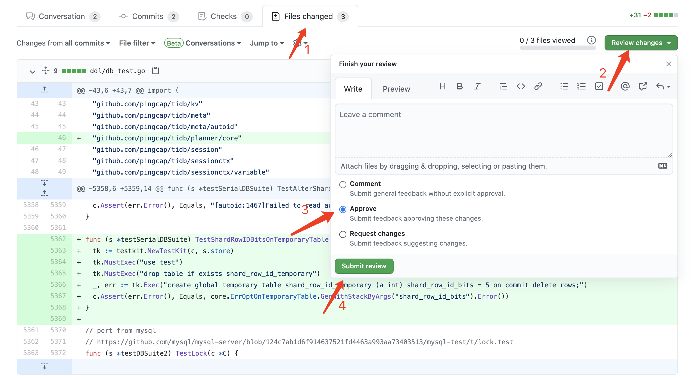

# This Week on TiDB 20210530

上周提到可以有一个协作编辑 Weekly 提供输入的地方，仔细想了一圈以后还是觉得协作文档的历史追溯不太舒服，采用魔改 GitHub 的形式来完成。

下周的初稿目前以 Pull Request 的形式发布，欢迎提供素材或者直接编辑。

[draft: 20210606](https://github.com/tisonkun/weekly/pull/1)

## [Developer Forum](http://internals.tidb.io/)

[Upgrade golang version every six months](https://internals.tidb.io/t/topic/121)

@TennyZhuang 提议跟进 Golang 的版本发布节奏，每隔 6 个月更新 TiDB 相关 Golang 项目依赖的语言版本。承担社区基础设施开发和维护的成员之一 @zhouqiang-cl 同步了有按照每隔 6 个月跟进 Golang 版本的计划。

[TiFlink’s Followup](https://internals.tidb.io/t/topic/124)

@shanzi 同步了此前在 Hackathon 上实现的 TiFlink 项目目前在落地上的进展，主要涉及了利用 Flink 来实现 TiDB 的物化视图，以及实现了一个弱化版的 CDCClient 以支持拉取 TiKV 上存储的数据的两个技术点。@tison 和 @sunxiaoguang 表达了自己对于这个话题的观点并分享了自己的实践经验。欢迎加入到讨论中来发表你的见解。

[Announcing review approval process changes](https://internals.tidb.io/t/topic/132)

@tison 同步了此前达成的[共识](https://github.com/ti-community-infra/tichi/issues/561)，即仅支持通过 GitHub 原生 PR Review 的功能来表达 Approve 或者 Request Changes，不再支持 `/lgtm [cancel]` 的机器人命令。这是因为我们希望机器人只是作为协作流程上的小助手，解决力有未逮或者可以简化的工作，而不是作为一个总览一切的大管家。PR Review 的反馈可以参照下图提交。

[Better way to debug single unit test in tidb](https://internals.tidb.io/t/topic/141)

@lcwangchao 出于 tidb 单元测试与 GoLand 结合不佳提出了这个讨论，希望能够有更好的 debug 和运行单元测试的手段。目前 tidb 的单元测试依赖于一个小众的测试框架 gocheck 的魔改版本。现状的使用方式会在撰写中的[开发指南](https://github.com/zz-jason/tidb-dev-guide)中包含，但是是否有更好的方式尚待讨论。欢迎留下你开发 TiDB 调试单元测试时的体验和对改善现状的意见。

[How do create a topic for release notes?](https://internals.tidb.io/t/topic/131)

@dragonly 提问了如何在 TiDB Internals 论坛上发布 release note 一类的信息以达到公示的效果，@tison 举了之前 Golang 版本升级的[公告贴](https://internals.tidb.io/t/topic/104)的例子回应。这是目前行之有效的一种方式。

[Bump grpcio to 0.9 globally](https://internals.tidb.io/t/topic/120)

@SchrodingerZhu 发布了升级 tikv / tiflash / kvproto 相关 grpcio 库的提议，这主要是为了更新上述项目所依赖的 GCC 版本。

[Where is the implementation of self.send of RaftRouter?](https://internals.tidb.io/t/topic/135)

@lyy4j 在阅读 TiKV 代码的过程中遇到了方法没找到对应实现的困难，@tison 指出对应实现的位置后 @lyy4j 自己理解了背后的原理。

## TiDB Development

[system-variables: ensure alphabetical order](https://github.com/pingcap/docs/pull/5711)

@morgo 优化了 TiDB 系统变量的文档，主要是做了字母排序和文本内容改善。适当的排序有助于读者快速定位到想要查找的内容，文档同样是软件重要的一部分，文档的贡献同样是被认可的对 TiDB 的贡献。

[Column Type Change](https://github.com/pingcap/tidb/projects/66)

@zimulala 主导了 TiDB 列类型变更的系列工作开发。列类型变更主要用于从更小位数或更低精度的类型向更大位数或更高精度类型的转换。

[Support temporary table](https://github.com/pingcap/tidb/issues/24169)

临时表的开发仍在进行中，@Howie59 @tiancaiamao @djshow832 本周推进了 DDL 侧的工作以及现有功能冲突的修复。

- [ddl: add auto random && shard_row_id_bits compatibility for temporary table](https://github.com/pingcap/tidb/pull/24940)
- [ddl: add foreign key compatibility for temporary table](https://github.com/pingcap/tidb/pull/24961)
- [*: add global system variable temptable_max_ram](https://github.com/pingcap/tidb/pull/24827)
- [executor: avoid distsql request for TableReader/IndexReader/IndexLookup on temporary table](https://github.com/pingcap/tidb/pull/24769)
- [ddl: Forbid set tiflash replicas on temporary tables](https://github.com/pingcap/tidb/pull/25036)

## Notable bugs

- [Update with Sub-Query got wrong result](https://github.com/pingcap/tidb/issues/24855)
- [dml: select result is not compatible with MySQL while joining a subquery with a where clause evaluated to false](https://github.com/pingcap/tidb/issues/24865)
- [executor: select result with truncated values is not compatible with MySQL](https://github.com/pingcap/tidb/issues/24893)
- [DML: insert with value of bit type. Not compatible with mysql](https://github.com/pingcap/tidb/issues/24900)
- [Restore database requires ALTER TABLE privilege](https://github.com/pingcap/tidb/issues/24912)
- [Executing STDDEV_SAMP with DISTINCT behaves differently than MySQL](https://github.com/pingcap/tidb/issues/24920)
- [str_to_date is not compatible with MySQL under some input](https://github.com/pingcap/tidb/issues/24928)
- [a query may hang forever when its plan has a ParallelApply under TopN](https://github.com/pingcap/tidb/issues/24930)
- [view returns unexpected error when containing count(*)](https://github.com/pingcap/tidb/issues/24933)
- [kv oom when tidb has data writing and cdc incremental data sync task](https://github.com/pingcap/ticdc/issues/1844)
- [Changefeed checkpoint get stuck after resume，network latency 100ms](https://github.com/pingcap/ticdc/issues/1864)

## Events, Blog Posts, Misc

本周随机到这个栏目为空。

其实就是没有随手记录所以一时也列不出来，尬住。

后续应该会随手记到 [draft: 20210606](https://github.com/tisonkun/weekly/pull/1) 上，也欢迎各位把自己举办、撰写或者看到的博客或者活动同步到上面。藉由 Weekly 的平台广而告之。
